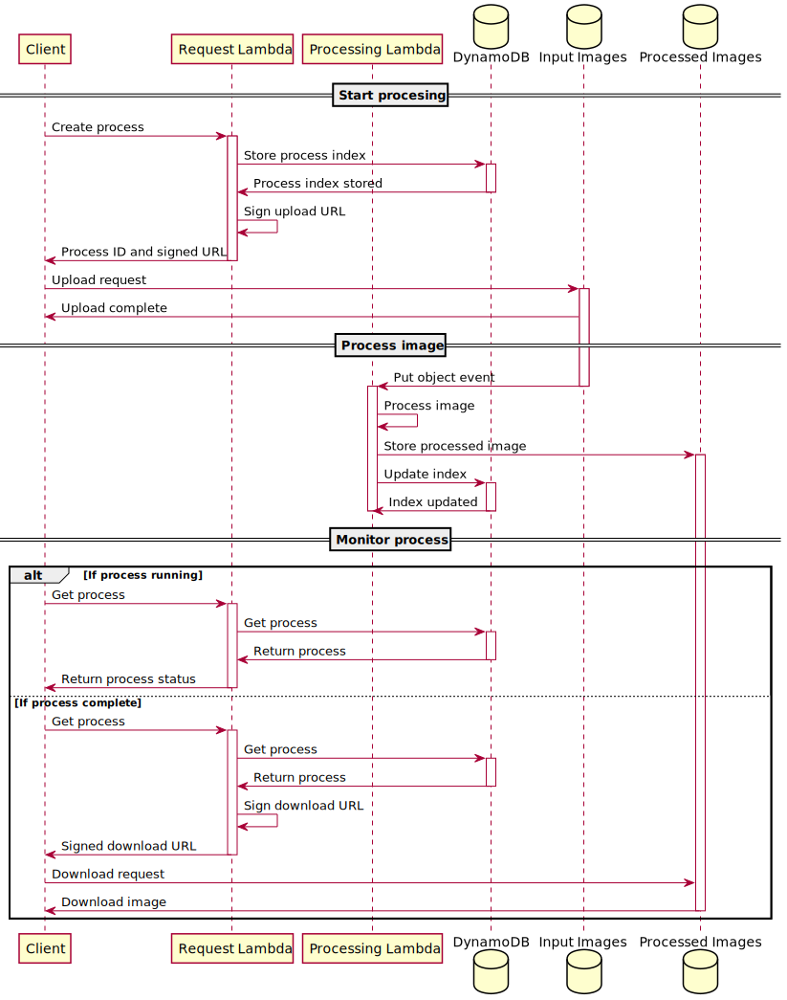

# Architecture

## Architecture patterns

Given the time the image processing might take to complete, we should avoid
having a single long running request for all the processing. Instead we might
want to create a resource which can be used to manage the whole process.

Making use of a resource to manage the process would provide the client with a
unique reference to manage the running process. With this reference the client
can check the processing, each single request would complete in a short amount
of time.

## AWS technologies

Given the breadth of available services on AWS it makes sense to discuss a
serverless approach in terms of AWS services.

### AWS Lambda

An obvious approach is to make use of a lambda function. A lambda function can
run for up to 15 minutes using fairly powerful compute. A common approach with
data processing or image processing pipelines is to run a lambda function using
events generate from S3 following data storage. However, we are looking to make
this service available through a basic REST API.

Lambda functions can be initiated by an API Gateway. The limitation of the API
Gateway is that requests are limited to 30 seconds. Any request longer than this
limit fails. For use cases where fire and forget is permissible then lambda can
be invoked as an event from API Gateway, however, there is no easy way to check
the status of the image processing.

### Challenges

1. Abstract the process behind a simple REST API using API Gateway.
2. Upload a file using API Gateway for use in the Lambda function.
3. Defining and packaging the required dependencies.

### Important limitations

- AWS Lambda can be invoked with a maximum payload size of 6 MB.
- Amazon API Gateway has a maximum timeout of 30 seconds.

For more details see
[Implementation considerations - Serverless Image Handler](https://docs.aws.amazon.com/solutions/latest/serverless-image-handler/considerations.html).

## Proposed architecture

In order to implement a long running image processing job we will use a
combination of API Gateway, AWS Lambda, AWS S3 and DynamoDB. The Lambda
functions can roughly be split into those which service requests and those which
are used to process images.

